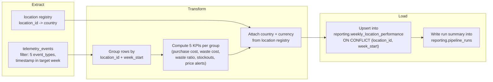

Weekly Location Cost & Waste Report — Pipeline Design

Design document for the business performance pipeline described in `CONTEXT-brasaland.md`
(data pipelines context). No orchestration code yet — this is the design phase.

---

## Phase 1 — Current State Analysis

### What already exists

- **Source of truth:** `telemetry_events` in Supabase, one row per event — `event_id`
  (primary key), `timestamp`, `session_id`, `user_id`, `event_type`, `schema_version`,
  `request_id`, and `tags` (JSONB, the event's `properties`), with a GIN index on `tags`
  (`services/api/telemetry_models.py:29-54`). Fourteen event types are captured today,
  defined in `docs/telemetry/event-schemas.json`.
- **Existing technical report:** `GET /telemetry/report` (`services/api/routes/telemetry.py:147-194`),
  backed by five metric functions in `services/api/telemetry_analysis.py` — event volume
  per day, event-type breakdown per day, API error rate, API latency, and auth failure
  rate. All five answer *engineering* questions (is the system healthy, is it busy).
  None of them touch cost, waste, or a specific location.

### The business gap

Mariana's weekly report needs *business* numbers — cost and waste, per location, per
week — and nothing in the current report produces that. `services/telemetry/analysis.py`
and `GET /telemetry/report` stay exactly as they are; this pipeline is new and separate,
reading the same `telemetry_events` table but producing a different output for a
different audience.

### Schema prerequisite #1 — two events are missing a cost field

`CONTEXT-brasaland.md` §3 already flags this, and checking the actual schema confirms it:

- **`inbound_order_created`** — the backend already computes a cost value:
  `IngredientEntryRead.unit_cost` and `.historical_avg_cost`
  (`services/api/inventory_schemas.py:46-64`), calculated in
  `services/api/routes/inventory.py:104-141`. But the `track()` call that actually builds
  this event's properties (`uis/backoffice/lib/inventory.ts:139-152`) never includes
  `unit_cost` — and `docs/telemetry/event-schemas.json`'s `inbound_order_created` entry
  doesn't list it either. The data exists one line above where it's needed; it's just not
  being captured.
- **`stock_waste_registered`** — no cost field exists anywhere in this chain.
  `IngredientExit` (`services/api/inventory_models.py:61-75`) and
  `IngredientExitCreate`/`IngredientExitRead` (`services/api/inventory_schemas.py:67-97`)
  have no `unit_cost` equivalent at all, unlike `IngredientEntry`, which has one
  (`inventory_models.py:54-58`).

Both are additive fields on existing mandatory events, per CONTEXT-brasaland.md — not new
event types, so they're in scope for this pipeline's design (not a rewrite of the
technical report). What this pipeline needs, to be handed to the implementation phase:

| Event | New field | Where it comes from |
|---|---|---|
| `inbound_order_created` | `unit_cost` (number, nullable) | Already computed — just pass `entry.unit_cost` into the existing `track()` call at `lib/inventory.ts:139-152`. |
| `stock_waste_registered` | `unit_cost` (number, nullable) | Doesn't exist yet. Needs a new `unit_cost` column on `IngredientExit`, mirroring `IngredientEntry.unit_cost`. Since waste has no purchase price of its own, the cleanest source is the ingredient's most recent `unit_cost` from `IngredientEntry` at the moment of waste — the same "look at prior entries" pattern already used for `historical_avg_cost` in `routes/inventory.py:120-126`. |

Purchase cost and waste cost per row = `quantity × unit_cost` at aggregation time — no
`total_cost` field is needed, since `quantity` is already captured on both events.

### Schema prerequisite #2 — the real blocker: no location → country mapping

This is bigger than the cost fields and isn't called out explicitly in
`CONTEXT-brasaland.md`, but it blocks the whole report: **every inventory event carries
`location_id` as a plain integer (1–14), but `country` and `currency` are hardcoded
`null` on every single one of them**
(`LOCATION_COUNTRY_UNRESOLVED` / `LOCATION_CURRENCY_UNRESOLVED`,
`uis/backoffice/lib/inventory.ts:88-94`). This was a deliberate, documented decision from
the telemetry unit — *"there is no reliable way to derive a location's country from
inventory's `location_id` today... filling in a guessed value would be worse than an
honest null"* (see `docs/telemetry/telemetry-plan.md` §2). It's confirmed by
`scripts/incidents-brasaland.csv`, which uses its own incompatible scheme
(`COL-07`, string codes with the country baked in) — the two features never agreed on
one location numbering.

The destination table this pipeline writes to requires `country` and `currency` on every
row, and the business constraint is explicit: **never mix currencies in one aggregate
row.** Without knowing which of the 14 numeric `location_id`s are Colombia vs. Florida,
this pipeline cannot correctly group or label a single row.

I'm not going to guess the mapping — same call the earlier milestone made, for the same
reason: a wrong guess here would silently mislabel money as the wrong currency, which is
worse than a visible gap. The design below treats this as a real, named prerequisite: a
small **location registry** — `location_id → country` — that has to be seeded from
Brasaland's actual location list (something Felipe's team has, but the codebase doesn't
yet), before this pipeline can run correctly. `currency` doesn't need its own column in
that registry — it's a direct 1:1 derivation (`CO → COP`, `US → USD`), matching how the
`country`/`currency` enums already pair up on every event.

---

## Phase 2 — Pipeline Design

### Purpose

Produce Mariana's Weekly Location Cost & Waste Report: purchase cost, waste cost, waste
ratio, stockout count, and price-alert count, per location, per week — computed from
`telemetry_events` — matching the five KPIs and the exact destination table named in
`CONTEXT-brasaland.md` §2 and §5.

### Extraction format

- **Source 1:** `telemetry_events`, filtered to
  `event_type IN (inbound_order_created, outbound_order_created, stock_waste_registered,
  stock_threshold_triggered, ingredient_price_variance_detected)` and
  `timestamp` within the target ISO week (Monday 00:00 UTC through the following Monday).
  `outbound_order_created` is extracted alongside the others for volume context (per
  CONTEXT-brasaland.md's note) but isn't aggregated into a KPI column in v1.
- **Source 2:** the location registry (`location_id → country`) from Schema
  prerequisite #2 above — a small reference table, read once per run, not filtered by
  week.
- **Shape:** each `telemetry_events` row's `tags` JSONB column already holds the
  event-specific properties (`location_id`, `quantity`, `unit_cost`, etc.) — extraction
  is a straight SQL `SELECT` on `event_type` + `timestamp`, no joins needed at this stage.
- **Cadence:** weekly, matching the destination table's `unique(location_id, week_start)`
  grain — one full run computes all 14 locations for one week.

### Data flow



### Update strategy

The destination table's `unique(location_id, week_start)` constraint is the whole
mechanism: every load is an **upsert** (`INSERT ... ON CONFLICT (location_id, week_start)
DO UPDATE`), never a plain insert. Re-running the pipeline for a week that's already been
computed overwrites that week's 14 rows with freshly recomputed numbers — it never
creates duplicates, and it never needs to figure out which fields changed, because the
whole row is always recomputed from `telemetry_events` (the source of truth), not
incremented.

---

## Phase 3 — Resilience and Idempotency

### Idempotency strategy

Recompute, don't accumulate. Every run reads the full set of matching events for a given
`week_start` fresh from `telemetry_events` and overwrites that week's rows via upsert.
Because `telemetry_events` is append-only and immutable (`telemetry_models.py:14-18`
already documents this — no route issues an UPDATE or DELETE against it), recomputing a
week from scratch always produces the same result as long as no new matching events have
arrived since. This one rule answers all three idempotency questions below.

**1. Duplicates at the source.** `event_id` is `telemetry_events`' primary key
(`telemetry_models.py:32`), so a literal duplicate row can't exist in the source table —
the ingestion side already rejects that at write time. This pipeline reads read-only, so
it doesn't need its own dedup logic for correctness, but the extraction query still
de-duplicates on `event_id` defensively (cheap insurance, in case that guarantee ever
changes) rather than trusting the source blindly.

**2. Re-run after failure.** If the load step dies after writing 8 of 14 locations, the
next run doesn't try to resume from location 9 — it just recomputes and upserts all 14
from scratch. At this scale (14 rows a week) a full recompute is simpler and cheaper than
tracking partial progress, and the upsert makes it safe regardless of where the previous
run stopped.

**3. Late events.** A delayed event (e.g. a browser retry that finally lands hours later)
for an already-published week doesn't get appended anywhere — the next scheduled run for
that week's `location_id` simply recomputes and overwrites the row with the now-complete
totals. To actually catch this in practice, the weekly run recomputes not just the
current week but the **trailing 2 weeks** every time it runs, so a late event has a real
chance to be picked up before the numbers are considered final. `computed_at` on each row
records when it was last recomputed, so the report can always show "as of" freshness
without losing any audit trail — nothing is ever incremented, so there's no double-count
risk to begin with.

### Observability

**1. Silence vs. true absence.** Three distinct states have to be distinguishable: *the
pipeline ran and this location genuinely had zero activity* (a real row exists, with
zeroes), *the pipeline hasn't run for this week yet* (no `pipeline_runs` entry), and *the
pipeline ran but failed before finishing* (`pipeline_runs` entry exists with
`status=Failed`). The minimum signal for this: **every** scheduled or manual trigger
writes a `pipeline_runs` row the moment it starts, before touching any data — so absence
of a run entry always means "never ran," and a run entry with no matching location rows
means "ran, but didn't finish."

**2. Collection traceability.** Each `pipeline_runs` row records `started_at`,
`completed_at`, and `records_processed`; each `weekly_location_performance` row records
`computed_at`. Comparing `pipeline_runs` timestamps week over week (they should land
~7 days apart) surfaces schedule gaps or drift, and comparing `records_processed` week
over week surfaces sudden bursts or drops in event volume. As an independent cross-check,
the existing `GET /telemetry/report`'s `events_by_type_per_day` metric can confirm
whether `telemetry_events` itself actually saw that volume of `inbound_order_created` /
`stock_waste_registered` events in the same window — if the technical report shows normal
volume but this pipeline's `records_processed` doesn't match, the bug is in this
pipeline's extraction, not in the business.

**3. Growth vs. data loss.** Same cross-check as above, one level up: if this week's
`total_purchase_cost` swings sharply, checking the *count* of `inbound_order_created`
events for the same week (via `records_processed`, or directly against
`events_by_type_per_day`) tells you whether it's a real change in order volume (business
growth or a bad week) or a capture/transform problem (event count is flat, cost isn't —
that's a bug, not news).

### Recoverability

**1. Database outage.** Extraction and load both hit the same Supabase instance, so a
connection drop mid-run fails the whole run, not half of it. Recovery is just re-running
the flow from the top on the next trigger — no checkpoint is needed beyond what
`pipeline_runs.status` already records (`Failed` → safe to retry in full, per the
idempotency strategy above).

**2. Frontend buffer.** Doesn't apply here — this pipeline has no browser component at
all; it's a scheduled backend job reading rows Supabase already has. Browser-side
reliability (offline buffering, `sendBeacon`, retry with backoff) was already solved in
the Capture phase (`uis/backoffice/lib/telemetry.ts`) for getting events *into*
`telemetry_events` in the first place — this pipeline starts downstream of that.

**3. Transmission retry.** The equivalent question here is what happens if the *load*
step's upsert gets retried (e.g. the flow itself retries after a transient connection
error). Because every load is `ON CONFLICT DO UPDATE` on `(location_id, week_start)`, a
retried upsert with the same computed values is a no-op in effect — there's no
"already stored" vs. "retry" distinction to make, the same way there is for the raw event
ingestion endpoint. Idempotent-by-construction here, not idempotent-by-checking.

### Cross-cutting: concurrent runs

The weekly schedule and a manual trigger (`POST /reporting/pipeline-runs`) could overlap
on the same `week_start`. Since both would compute from the same `telemetry_events`
snapshot, the worst case is two "Completed" runs logged for the same week with the same
numbers — not a correctness bug, but confusing to read. Rather than custom locking code,
this is a Prefect concurrency limit: tag the flow with the `week_start` being computed and
cap concurrency at 1 per tag, so a second trigger for a week already `Running` queues
instead of racing it.

### Execution log — `reporting.pipeline_runs`

| Field | Type | Why it's needed |
|---|---|---|
| `run_id` | uuid | Distinguishes two runs for the same week (e.g. schedule vs. manual trigger) in the log and in API responses. |
| `week_start` | date | Which week this run computed — a run isn't always "this week" (see late-events recompute). |
| `triggered_by` | text (`schedule` \| `manual`) | Needed for the concurrent-runs guard, and to answer "did someone force this or did it run on its own" when debugging. |
| `started_at` | timestamptz | Written the moment the run begins, before any data is touched — this is what makes "never ran" vs. "ran" distinguishable (Observability Q1). |
| `completed_at` | timestamptz, nullable | Null while running; a long-null `started_at` with no `completed_at` is itself the "stuck or crashed" signal. |
| `status` | enum (`Running` \| `Completed` \| `Failed`) | Mirrors Prefect's own state model directly — the field the two status endpoints actually read. |
| `records_processed` | integer | How many `telemetry_events` rows this run read — used for both the "did extraction actually work" check and the growth-vs-loss cross-check. |
| `locations_written` | integer | How many rows were upserted; less than 14 means something didn't compute for one or more locations. |
| `error_message` | text, nullable | The actual failure reason when `status=Failed` — "it failed" alone isn't debuggable later. |

---

## Phase 4 — Mapping to Prefect

Prefect concepts used here: a **flow** is the whole run; **tasks** are its individual
steps; **states** track whether the flow/task is running, done, or failed; **blocks** hold
configuration and credentials so they're not hardcoded or scattered across files.

- **Main flow:** `weekly_location_performance_flow(week_start: date)` — orchestrates one
  week's run end to end.
- **Tasks** (at least three, matching the extract → transform → load stages):
  1. `extract_weekly_events(week_start)` — queries `telemetry_events` for the five event
     types in the target week, plus the location registry.
  2. `transform_location_metrics(events, registry)` — pure function: groups by
     `location_id`, computes the five KPIs, attaches `country`/`currency`. No database
     access in this task, so it's testable on its own.
  3. `load_weekly_performance(rows, run_id)` — upserts the computed rows into
     `reporting.weekly_location_performance`, then updates the `pipeline_runs` row for
     `run_id` to `Completed` with `locations_written` set.
  4. *(optional, matches the "raise the bar" note)* `validate_location_registry(events,
     registry)` — checks that every `location_id` seen in this week's events actually has
     a registry entry, and logs (rather than silently drops) any that don't. Keeps the
     honest-gap-handling approach from Phase 1 alive at the pipeline level instead of
     failing silently.
- **States:** `Running` is set the moment the flow starts (before task 1); `Completed`
  after task 3 finishes; `Failed` if any task raises. These map directly onto
  `pipeline_runs.status`. Prefect's built-in task retries (e.g. 2 retries with backoff)
  handle transient Supabase connection errors without custom retry code, per the
  Recoverability answer above.
- **Optional second flow:** `backfill_weekly_performance_flow(start_week, end_week)` —
  calls the same three tasks once per week in the range. Covers both the late-events
  recompute case (Idempotency Q3) and bootstrapping historical weeks the first time this
  pipeline runs. Kept optional for Part 1, per the brief.
- **Blocks:**
  1. A Supabase/Postgres connection block, replacing the bare `os.getenv("DATABASE_URL")`
     pattern currently in `services/api/database.py:62` — so the connection is managed by
     Prefect rather than copied across scripts.
  2. The location registry doesn't need its own block if it's stored as a table in the
     same Supabase database (read inside `extract_weekly_events` via the same connection
     block) — no separate credential to manage.

---

## Phase 5 — Application Integration

### A note on `services/reporting/`

`CONTEXT-brasaland.md` calls for a new `services/reporting/` module. Worth flagging: the
telemetry unit already hit this exact question and deliberately did *not* create a
literal new top-level `services/telemetry/` directory — `telemetry_analysis.py` lives
inside `services/api/` instead, because `services/Dockerfile` and `docker-compose.yml`
only build and mount `services/api/` (plus two specific sibling folders); a new top-level
service directory would need its own Dockerfile/compose entry for no shared-code benefit
(see `telemetry_analysis.py:1-14`'s own docstring for that reasoning).

Same call applies here: `services/reporting/` will be a new **router and file set inside
`services/api/`** — `routes/reporting.py`, registered in `main.py` next to
`telemetry_router` (`main.py:73-85`) — not a new deployable service. It stays separate
from `routes/telemetry.py` and `GET /telemetry/report` by being entirely different files,
which is what CONTEXT-brasaland.md's separation requirement actually needs.

### Endpoints

| Endpoint | Calls into `data/pipelines/` | Notes |
|---|---|---|
| `GET /reporting/weekly-location-performance` | `data/pipelines/weekly_location_performance/read.py::get_week(week_start)` | Thin read of `reporting.weekly_location_performance`, same "endpoint doesn't calculate anything" rule `GET /telemetry/report` already follows. Defaults to the most recently computed week. |
| `GET /reporting/pipeline-runs/latest` | `data/pipelines/weekly_location_performance/runs.py::get_latest_run()` | Thin read of `reporting.pipeline_runs`, newest row. |
| `POST /reporting/pipeline-runs` | `data/pipelines/weekly_location_performance/flow.py::weekly_location_performance_flow` | Triggers the flow for the current (or a specified) week; returns the new `run_id` immediately rather than blocking until the flow finishes. |

No ETL logic lives in `services/api/` — every route above is a thin caller into
`data/pipelines/weekly_location_performance/`, matching the layout convention already
established in `data/pipelines/README.md`.

---

## Implementation notes (Part 2)

**Layout changed from what's sketched above.** Part 2's own instructions require the main
entry point to be exactly `data/pipelines/pipeline.py`, with `data/raw/`, `data/process/`,
and `data/eval/` as the supporting folders — a flatter layout than the
`data/pipelines/weekly_location_performance/` subpackage sketched in the Endpoints table
above. The actual implementation is one file, `data/pipelines/pipeline.py`, containing the
flow and all four tasks; the three endpoints import directly from it
(`from pipeline import weekly_location_performance_flow`) rather than from
per-concern `read.py` / `runs.py` / `flow.py` modules. The stages, KPIs, tables, and
resilience strategies designed above are unchanged — only the file split is different from
what this document originally sketched, because Part 2's instructions arrived with a more
specific structure than Part 1 had to work from.

**Run command:**

```bash
cd services/api && uv run python ../../data/pipelines/pipeline.py
# or a specific past week, e.g. for the late-events recompute case (Idempotency §3):
cd services/api && uv run python ../../data/pipelines/pipeline.py --week-start 2026-08-24
```

Run from within `services/api/` so it uses that project's `uv`-managed virtual environment
(where `prefect` is installed) — `data/pipelines/` has no `pyproject.toml` of its own. The
same reasoning `services/Dockerfile` already documents for reaching `scripts/` and
`packages/shared/` applies here: `pipeline.py` puts `services/api` on `sys.path` itself, so
this works whether it's invoked directly or imported by `routes/reporting.py`'s manual
trigger endpoint.

**Intended schedule:** weekly, matching Mariana's Monday-morning reporting cadence
(CONTEXT-brasaland.md §1) — the cron trigger would run early Monday UTC, computing the week
that just closed. A production deployment would register `weekly_location_performance_flow`
with a Prefect deployment/schedule instead of relying solely on the CLI or the manual-trigger
endpoint; that wiring is future work, not part of this milestone's scope.

---

## Open items before implementation begins

1. **Location registry data** — need the real `location_id → country` list from Felipe's
   team. Nothing in the codebase should guess this. **Status:** still open. The Part 2
   implementation uses an explicit placeholder (`LOCATION_REGISTRY` in `pipeline.py`,
   mapping only the two location_ids that appear in `seed_inventory.py`'s data) and flags
   any other `location_id` it encounters to `data/eval/` rather than guessing — but the
   other 12 real locations still need to come from the business before this is complete.
2. **Two schema additions** — `unit_cost` on `inbound_order_created`'s captured
   properties (pass-through of data already computed) and a new `unit_cost` field on
   `IngredientExit` for `stock_waste_registered` (genuinely new data). **Status: done** —
   both added in Part 2 (`inventory_models.py`, `inventory_schemas.py`,
   `routes/inventory.py`, `lib/inventory.ts`, `docs/telemetry/event-schemas.json`).
3. **`prefect` isn't in `services/api/pyproject.toml` yet** — will need adding when
   implementation starts; not required for this design-only phase. **Status: done** —
   `prefect>=3` added via `uv add`.

---

## Implementation notes (Part 3)

**Subflow refactor.** The main flow no longer contains any ETL logic — it coordinates four
subflows: `extract-cost-and-waste-events`, `transform-weekly-location-performance`,
`flag-unmatched-locations` (optional, invoked with `return_state=True`), and
`load-weekly-location-performance`. The transformation stage, previously one task computing
all five KPIs together, is now five small tasks — `compute-purchase-cost-per-location`,
`compute-waste-cost-per-location`, `compute-waste-ratio`, `compute-stockout-frequency`,
`compute-price-alert-frequency` — plus `assemble-weekly-location-performance-rows` to join
them into destination-table rows. Each KPI task is a pure function (no database access),
which is what makes them independently unit-testable — see `tests/pipelines/test_pipeline.py`.

**Optional enhancement picked up: the concurrency guard from Cross-cutting §1.** Part 1's
design doc originally proposed a Prefect concurrency-limit tag to stop the weekly schedule
and a manual trigger from racing each other on the same `week_start`. That's implemented now,
but not with a Prefect-native concurrency limit — this pipeline runs against Prefect's own
ephemeral local server (no persistent Prefect Cloud/Server available in this environment), so
a registered concurrency limit wouldn't reliably persist between runs. Instead,
`weekly_location_performance_flow` checks `reporting.pipeline_runs` itself for an
already-`Running` row for the target week before starting a new one, and returns a
`{"skipped": true, ...}` result instead of starting a second run if one is found. Same
protective goal as the original proposal, no new infrastructure dependency. Verified by
seeding a fake `Running` row and confirming a second trigger for that week is skipped rather
than racing it, rather than merely reasoned about.

**Dashboard.** `uis/backoffice/app/(protected)/reporting/page.tsx` — fetches
`GET /reporting/weekly-location-performance` and renders all five KPIs from CONTEXT-brasaland.md
section 2 in one table, labeled with the same names used there, plus the week period and a
per-currency summary (COP and USD totals are never combined, matching section 7's business
constraint). Nav link added in `uis/backoffice/app/layout.tsx`.
